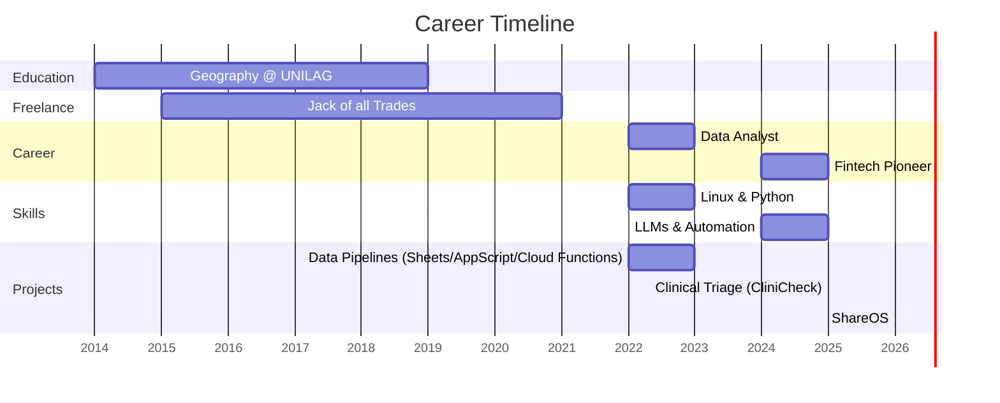

# About me

- **2014-2019**: Studying Geography at UNILAG
- **2015-2021**: Graphics Design, Data Entry, Data Annotation
- **2022-2023**: Got a Chromebook, fiddled with Linux, took Google Analytics on Coursera, played with R Studio, switched to Google Colab, built data pipelines with Google Sheets, Apps Script, and Google Cloud Functions
- **2024-Present**: Joined pioneering fintech company to digitize back office processes, started experimenting with LLMs, built clinical triage prototype (CliniCheck) and sharing platform (ShareOS) - still building daily
